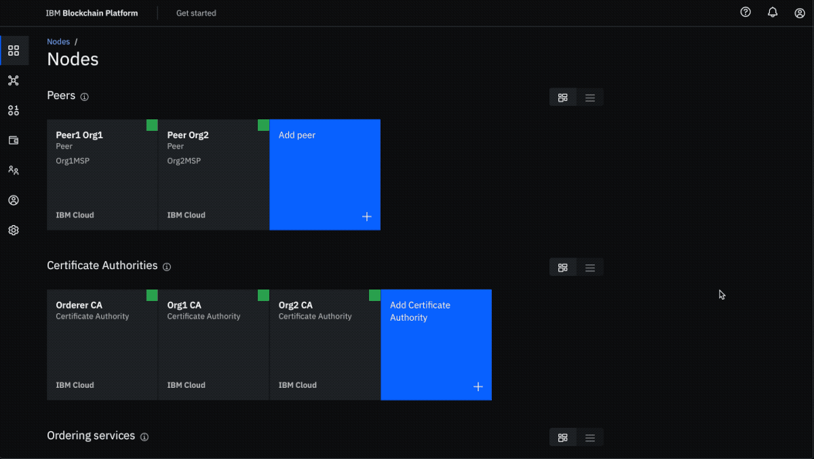
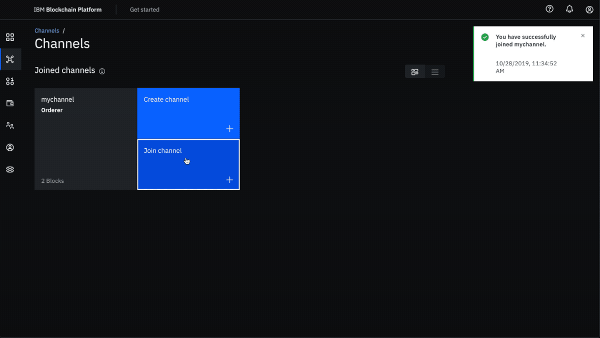

# Tutorial Title:
Learn how to use service discovery in the IBM Blockchain Platform.


# Tutorial Subtitle:
See how the service discovery feature can be used to dynamically obtain information (such as the peers, the orderers, the endorsement policies) about the Blockchain network when trying to execute the chaincode on peers and submitting transactions to the orderer.


# Introduction:

Note: If you are new to the IBM Blockchain Platform, you can try out the [Build your first blockchain application](https://developer.ibm.com/series/code-pattern-series-build-your-first-blockchain-application/) developer pattern series designed to get you started with blockchain.

Blockchain networks are managed using a program called the chaincode, written in Go, Node.js or Java. The [chaincode](https://hyperledger-fabric.readthedocs.io/en/release-1.4/chaincode.html#what-is-chaincode) contains the business logic required to initialize and manage the blockchain ledger state based on the transactions made by the application for the blockchain network. 

Applications that execute the chaincode that has been instantiated on a Blockchain network do so by connecting to the network using the Fabric API SDK (Node, Java or Go). In order to successfully submit transactions to the orderers in the network, the application needs to have access to information such as the CA (Certificate Authority) and TLS (Transport Layer Security) certificates of the orderers and peers on the channel, their IP addresses and port numbers, the endorsement policies, as well as information about peers that have the chaincode installed (these are the peers that the application needs to send the transaction proposals to).

Prior to Hyperledger Fabric v1.2, this information needed to be statically provided to the application. However, this approach isn't reactive to changes that may occur in the network over time. These changes may include addition of new peers that have the chaincode installed on them, the temporary unavailability of existing peers or any modifications to the endorsement policies. The application also would have no way of knowing which peers' ledgers have been updated. If, in such a scenario, the application submits a proposal to a peer whose ledger data is not updated and as a result is not in sync with the rest of the network, the transaction would eventually be invalidated upon commit.

The service discovery feature, which was made available in the Hyperledger Fabric v1.2, improves upon this approach by ensuring that when an application tries to invoke the chaincode, the peers can compute the network information that they need dynamically without the need to depend on a static network configuration that may or may not have changed since it was provided to the application.

# Prerequisites:
* [IBM Cloud account](https://cloud.ibm.com/registration/?target=%2Fdashboard%2Fapps)
* [Node v8.x or greater and npm v5.x or greater](https://nodejs.org/en/download/)
* [VSCode version 1.26 or greater](https://code.visualstudio.com)
* [IBM Blockchain Platform Extension for VSCode](https://marketplace.visualstudio.com/items?itemName=IBMBlockchain.ibm-blockchain-platform)

# Estimated Time:
We will make use of the [fabcar](https://github.com/IBM/fabcar-blockchain-sample) developer pattern to demonstrate how service discovery can be incorporated into a blockchain application. This tutorial assumes you have an IBM ID and have set up the required [IBM Cloud Services](https://github.com/IBM/fabcar-blockchain-sample#3-create-ibm-cloud-services) as described in the fabcar developer pattern.

Once the pre-requisites have been installed, it should take you about 45-60 minutes to complete this tutorial (including the time required to follow through the instructions for the fabcar developer pattern).

# Steps:
1. Setting up anchor peers
2. Enabling Service Discovery

## 1. Setting up anchor peers:
The application needs to have knowledge about a group of peers which can be trusted to provide correct responses for discovery queries. Generally, a peer within the same organization as the user of the client application is a good candidate. Each peer in this group needs to have the EXTERNAL_ENDPOINT defined in order for them to be known to the discovery service. 

In the IBM Blockchain Platform, this can be achieved by setting a peer as an "Anchor peer". This can be done during the ["Build a network"](https://github.com/IBM/fabcar-blockchain-sample#4-build-a-network) section of the [fabcar](https://github.com/IBM/fabcar-blockchain-sample) developer pattern. 

A peer can be set as an anchor in one of two ways:
1) When joining the peer to the channel, the switch to set the peer as an "Anchor peer" is turned on by default.

<p align="center">
  
</p>

2) If the peer has already been added to the channel and if the switch was disabled so that the peer is not an anchor peer for that channel, the channel details can later on be updated to add this peer as an anchor peer. To set an existing peer as an anchor peer, you can go to the `Channels` tab in the left navigation pane and select your channel `mychannel`. Go to the `Channel details` tab and scroll to bottom. Under section `Anchor peers`, click the `Add anchor peer` button and select the peer you want to set as an anchor peer.

<p align="center">
  
</p>


## 2. Enabling Service Discovery:
The application issues a configuration query to the discovery service and obtains all the static information it would have otherwise needed to communicate with the rest of the nodes of the network. This information can be refreshed at any point by sending a subsequent query to the discovery service of a peer.

The service runs on peers – not on the application – and uses the network metadata information maintained by the gossip communication layer to find out which peers are online. It also fetches information, such as any relevant endorsement policies, from the peer’s state database.

With service discovery, applications no longer need to specify which peers they need endorsements from. The SDK can simply send a query to the discovery service asking which peers are needed given a channel and a chaincode ID. 

Let's have a look at how we can enable and utilize service discovery in the IBM Blockchain Platform using the Fabric Node SDK.

In order to create a transaction and add it to a block on the blockchain, the application needs to connect to the peers that will endorse the transaction and to the ordering service that will order the transaction. The connection endpoints for these peers and the ordering service can be provided to the application in the connection profile which can be used to construct a Fabric Gateway. The Fabric Gateway then conducts interactions with the Fabric Network. You can get more information about [using the connection profile to build a fabric gateway](https://cloud.ibm.com/docs/services/blockchain?topic=blockchain-ibp-console-app#step-four-use-the-connection-profile-to-build-a-fabric-gateway) in order to connect to a blockchain network in the IBM Cloud Documentation.

In order to use service discovery in your application, you need to use the following code to connect to your gateway:
```await gateway.connect(ccp, { wallet, identity: userName, discovery: { "enabled": true, "asLocalhost": false } });```

Here we are setting the value of "enabled" as `true` which is what turns on service discovery. Essentially this creates a dynamic gateway.

This is exactly what is done in the [network.js](https://github.com/IBM/fabcar-blockchain-sample/blob/master/web-app/server/src/fabric/network.js) script of the fabcar application with the only difference being that the discovery service configuration parameter of enabled is set to true in the [config.json](https://github.com/IBM/fabcar-blockchain-sample/blob/master/web-app/server/config.json), which is then referenced in network.js.

Once the gateway is created, the blockchain network is easily and dynamically obtained using the following small piece of code:
```
// Get the network (channel) our contract is deployed to.
const network = await gateway.getNetwork('mychannel');
// Get the contract from the network.
const contract = network.getContract('fabcar');
```

Try setting enabled as `false` in the config.json. When you try to run the application, you will get an error as service discovery has been disabled and the network information can no longer be dynamically obtained.

```
2019-10-28T15:42:59.535Z - error: [Network]: _initializeInternalChannel: no suitable peers available to initialize from
Failed to evaluate transaction: Error: no suitable peers available to initialize from
(node:14135) UnhandledPromiseRejectionWarning: SyntaxError: Unexpected token o in JSON at position 1
    at JSON.parse (<anonymous>)
    at network.queryAllCars.then (/Users/snyk/CognitiveApps/code-patterns/fabcar-blockchain-sample/web-app/server/src/app.js:19:35)
(node:14135) UnhandledPromiseRejectionWarning: Unhandled promise rejection. This error originated either by throwing inside of an async function without a catch block, or by rejecting a promise which was not handled with .catch(). (rejection id: 2)
(node:14135) [DEP0018] DeprecationWarning: Unhandled promise rejections are deprecated. In the future, promise rejections that are not handled will terminate the Node.js process with a non-zero exit code.
```

# Service discovery and the endorsement policy:
Once service discovery has been turned on, an endorsement request will be routed to the right peer(s) based on the endorsement policy. If the endorsement policy is set to "Any", the request can be routed to any peer on the network. However, you do have the opportunity to bind the policy directly to a particular organization's peer(s).

The service discovery information provided by the peer supplies two pieces of information - Layouts and EndorsersByGroup. With these two pieces of data, the SDK has the ability to send the request to the peer(s) from different organizations that meet the endorsement policy requirements. 

The Node.js SDK provides default code that uses the Layouts and EndorsersByGroups and sends it to the appropriate peers as per the endorsement policy. This code can be customized if the provided logic does not meet the users needs. You can refer the [Hyperledger Fabric Docs on Service Discovery](https://hyperledger-fabric.readthedocs.io/en/release-1.4/discovery-overview.html#how-service-discovery-works-in-fabric) for more information on the Layouts and EndorsersByGroups.


# Effects of updates to the network:
Let's have a look at the [mychannel_fabcar_profile.json](https://github.com/IBM/fabcar-blockchain-sample/blob/master/web-app/server/mychannel_fabcar_profile.json) file. It contains information about the network `mychannel`, the organization participating in this network `Org1 MSP`, as well as the urls and TLS CA certificates of the peer, the orderer and the certificate authority. 

If you create a new organization and add it to the channel, you need not update the mychannel_fabcar_profile.json with the information about this new organization and the peer. The discovery service can simply use the information of the first peer (which is already in the connection file) and the gossip data dissemination protocol to get latest state of the network. 

<p align="center">
  
</p>

This ensures that the addition of new peers, as well as the temporary or permanent unavailability of previously added peers does not cause failures in the application as long as at least one reliable anchor peer's information is provided to the application. 

# Summary

This tutorial showed you how to use service discovery in order to connect to a fabric network created using the IBM Blockchain Platform.

Now, when you use service discovery to submit a transaction for endorsement, the transaction request will automatically be sent to the right peer(s) based on the parameters such as endorsement policies specified within the network.


# Related Links
* [Hyperledger Fabric Docs - Service Discovery](https://hyperledger-fabric.readthedocs.io/en/latest/discovery-overview.html)
* [Hyperledger Fabric Docs - Fabric Gateway](https://hyperledger-fabric.readthedocs.io/en/release-1.4/developapps/gateway.html)
* [Hyperledger Fabric Docs - Gossip data dissemination protocol](https://hyperledger-fabric.readthedocs.io/en/release-1.4/gossip.html)
* [IBM Cloud Docs - Anchor peers used for Service Discovery](https://cloud.ibm.com/docs/services/blockchain?topic=blockchain-ibp-console-govern#ibp-console-govern-channels-anchor-peers)
* [IBM Cloud Docs - Using the connection profile to build a fabric gateway](https://cloud.ibm.com/docs/services/blockchain?topic=blockchain-ibp-console-app#step-four-use-the-connection-profile-to-build-a-fabric-gateway)
* [IBM Developer Pattern Series - Build your first blockchain application](https://developer.ibm.com/series/code-pattern-series-build-your-first-blockchain-application/)
